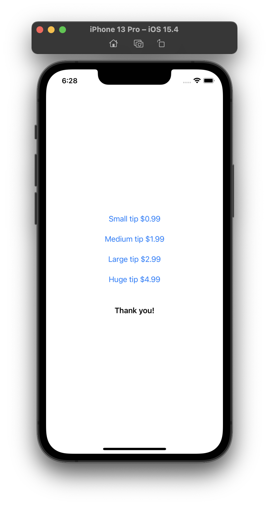

# SwiftUI tip jar example, using SwiftTipJar

This **SwiftUI** sample code demonstrates ease of use for [SwiftTipJar](https://github.com/dkasaj/SwiftTipJar) - an open source package. 
There is also [UIKit sample code](https://github.com/dkasaj/SwiftTipJar-UIKit-Example) (same functionality).  

Tip jars on Apple platforms are a concept of letting users make in-app purchases to show appreciation for the app/developer. These don't actually unlock any additional features.

## Demo app screenshots
| Choice of tips | System UI for purchasing | Successful purchase | Thank you message |
| - | - | - | - |
 |  |  | 

## Usage
1. Init TipJar with identifiers for In-App Purchases you wish to offer
2. Make TipJar observe StoreKit's payment queue. It's best if observed during entire lifetime of the app.
3. Let TipJar find out product information for identifiers you've supplied. It's either going to be fetched from Xcode (when using StoreKit Configuration file) or from App Store Connect over the network. 

```swift
// #1
tipJar = SwiftTipJar(tipsIdentifiers: Set(["com.test.smallTip", "com.test.largeTip"]))
// #2
tipJar.startObservingPaymentQueue()
// #3
tipJar.productsRequest?.start()
```

4. As soon as tipJar finds out about the products, it publishes _tips_, an array of Tip objects that supplies you with _displayName_ and _displayPrice_, in local language and currency. Array has been sorted by price, ascending. Products that haven't been configured with a name and/or price are simply omitted from this array. 

```swift
@Published public private(set) var tips: [Tip] = []
```

```swift
public final class Tip {
    public var identifier: String = ""
    public var displayName: String = ""
    public var displayPrice: String = ""

    /// TipJar uses this to quickly check if it should include this Tip in its published array.
    var isValid: Bool {
        return !identifier.isEmpty && !displayName.isEmpty && !displayPrice.isEmpty
    }
}
```
5. Assign any code you want to run after a successful purchase to _transactionSuccessfulBlock_, and similarly any code you want to run after a failed purchase (user clicked Cancel instead of Purchase) to _transactionFailedBlock_. 
With tip jars, it's even natural to do nothing if a transaction fails.  
```swift
.onAppear {
  tipJar.transactionSuccessfulBlock = {
    showingThankYou = true
  }
  tipJar.transactionFailedBlock = {
    // No need to do anything, user did tap cancel
  }
}
```
6. Set up button(s) to initiate a purchase to trigger the action _initiatePurchase(productIdentifier:)_ 
```swift
Button {
  tipJar.initiatePurchase(productIdentifier: tip.identifier)
} label: {
  Text("\(tip.displayName) \(tip.displayPrice)")
}
```


## Troubleshooting
**Q: I've set up IAPs in a StoreKit Configuration file, but nothing is showing up in the demo app**

A: Edit Scheme > Options, and check that you have the correct StoreKit Configuration selected

**Q: I've set up IAPs in StoreKit Configuration file, some are showing up in demo app, but not all**

A: Check that TipJar's init is called with all relevant identifiers; check identifiers for any spelling errors. Check that you've provided the name and price for every IAP you want to see in the demo app.
